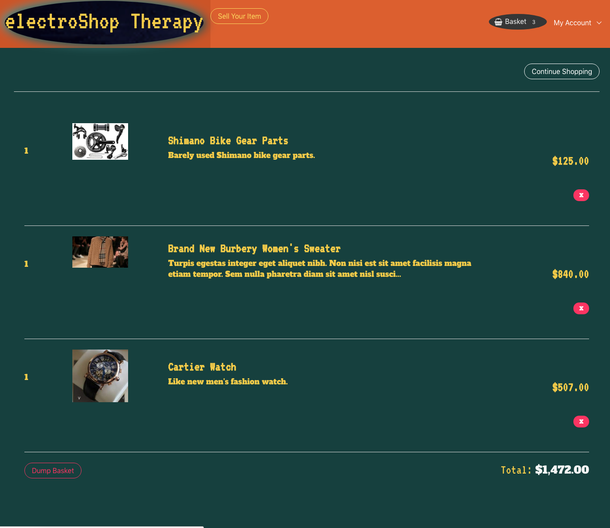

# [electroShop Therapy](https://ecomm-amitzaman.herokuapp.com/)
#### Please Click App Name Above to View Heroku Deployment

##### To use a login instead of having to create one, please type in the following credentials:
##### Username: user@gmail.com
##### Password: 123456

###### (Newer pictures from your computer might need to be uploaded if image links are broken - can be done using the "Edit" tab/link)
 

  

  
  
  

Author: [Amit Zaman](https://amitzaman.com/)

#### Technologies Used:
##### Ruby on Rails
##### PostgreSQL
##### Bulma

______________________
#### Local Execution:
rails s  
postgres -D /usr/local/var/postgres  
psql ecomm_shop_development  
sass --watch scss:css  
 
_____________________________
##### Dev Notes:
 
Heroku with Ruby/SQL:
-> Heroku is already set up to use Postgres, so you don't need any addons. To access DB, log into heroku psql:
heroku pg:psql

To Remove Items from DB:
DELETE FROM items WHERE id = x;
(to delete from database)

To View Items, Users, etc from DB:
SELECT * FROM items;
______________________________________

* Ruby version
2.5.0

#### In this Ruby on Rails app, you can create an account, sell and edit your items by uploading details. Additionally, you can place in your shopping basket items uploaded from others where you can view item totals and and delete individual items or the whole shopping basket.

#### To see the app's Heroku deployment, please see link above.

##### [Amit](https://github.com/amitzed)
